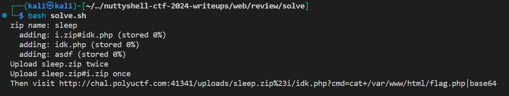
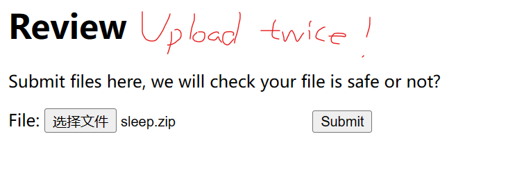
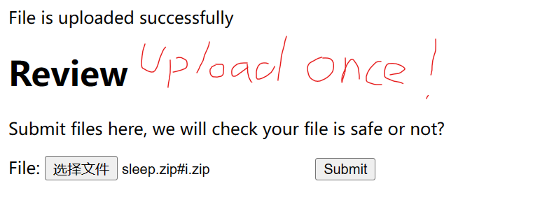
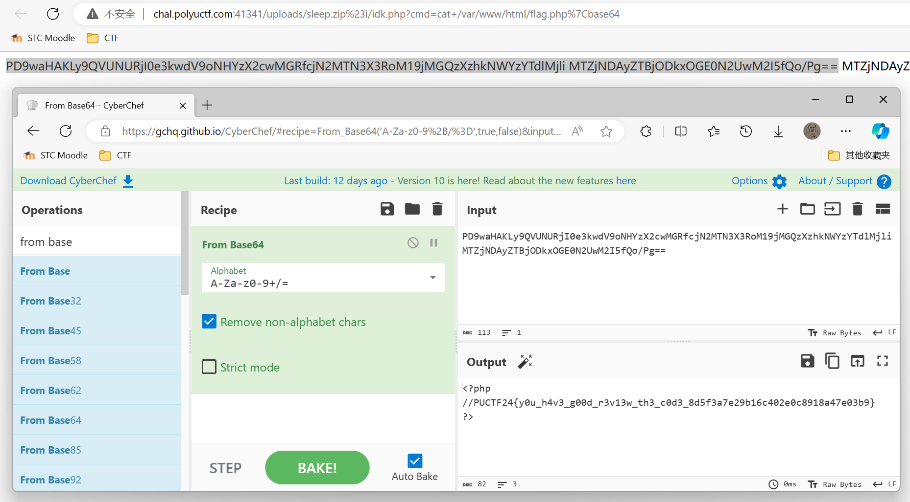
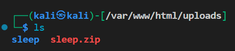
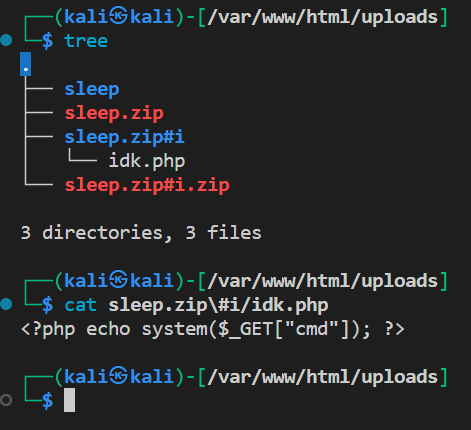

# Review 審計

```bash
cd solve
bash solve.sh
# then type the zip filename you prefer
# follow the instructions
# decode base64
# done
```






flag: PUCTF24{y0u_h4v3_g00d_r3v13w_th3_c0d3_8d5f3a7e29b16c402e0c8918a47e03b9}

## Explaination 

Basically a kind of uri(?) injection

On the second time uploading `sleep.zip`, it throws a `Directory is already exists` exception before `sleep.zip` is unlink, so `sleep.zip` is kept under `uploads` directory



When `sleep.zip#i.zip` is uploaded. the server will concat the zip uri as `zip://./uploads/sleep.zip#i.zip#idk.php` which means `i.zip#idk.php` under `sleep.zip`

Therefore, the file `sleep.zip` -> `i.zip#idk.php` is extracted instead of `sleep.zip#i.zip` -> `idk.php` <br/>
The file is then copied to `uploads/sleep.zip#i/idk.php`



Then there is a file `asdf` that doesnt exist in `sleep.zip`, so the server throws an `Unzip failed!` exception before the php files are unlinked.

Then visit the corresponding url to access the shell php file `idk.php`, done

<details><summary>PS:</summary>
Actually I dont need to do the above stuffs. 😰 <br/>
What I need is just construct a zip file in this layout...:

1. web-shell.php
2. [CORRUPTED FILE ENTRY]

Wasting time again😰
</details>

